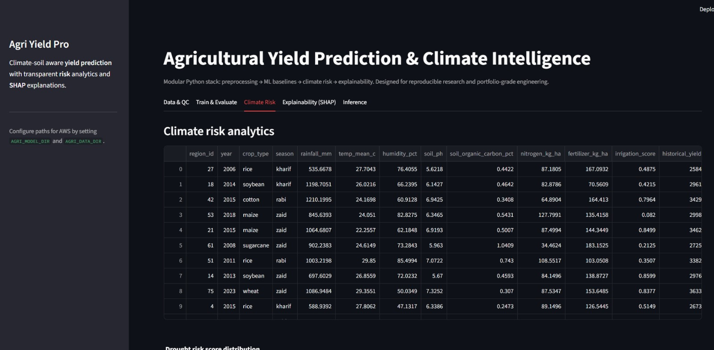
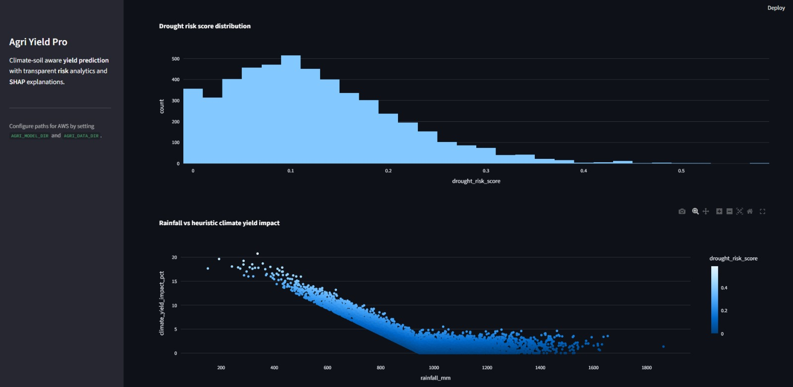

# Agri Yield Pro

**Agri Yield Pro** is a production-style research platform for **crop yield regression** from **climate, soil, and management** covariates. It combines reusable preprocessing and feature engineering, three comparable ML baselines (linear, random forest, XGBoost), transparent **climate risk** heuristics, **SHAP** explainability, a **Streamlit** analytics dashboard, and a **FastAPI** inference service suitable for containerized cloud deployment.

The repository is intentionally modular: data science logic lives in `utils/` and `backend/`, while `frontend/` hosts the interactive UI. A synthetic yet physically plausible dataset generator ships with the project so reviewers can reproduce results without hunting for proprietary files.

## Highlights

- **Data preprocessing**: missing-value handling (median / mode imputation), scaling, categorical encoding, optional outlier diagnostics (modified Z-score and IQR).
- **Feature engineering**: agronomic proxies (growing-degree-day style accumulation, rainfall–temperature ratio, soil quality composite).
- **Models**: `LinearRegression`, `RandomForestRegressor`, `XGBRegressor` with holdout metrics (**RMSE**, **MAE**, **R²**).
- **Climate intelligence**: drought risk scoring, rainfall deficiency vs. climatology proxy, heuristic climate-related yield impact for reporting layers.
- **Explainability**: SHAP summaries on the holdout design matrix (tree and linear explainers where supported).
- **Dashboard**: Streamlit tabs for QC, training, climate analytics, SHAP, and batch inference with Plotly charts.
- **Serving**: FastAPI endpoints for JSON and CSV batch scoring.
- **Deployment**: multi-service `docker-compose`, single `Dockerfile`, environment-driven paths for AWS-style artifact layout.

## Repository layout

```
data/          # Raw CSV location + dataset documentation
docs/          # Architecture notes (AWS-oriented)
frontend/      # Streamlit application
backend/       # Training, inference, and FastAPI service
models/        # Serialized joblib bundles (gitignored binaries)
notebooks/     # Exploratory templates
scripts/       # Dataset generation utilities
utils/         # Preprocessing, risk analytics, metrics, SHAP helpers
```

## Quickstart (local)

```bash
python -m venv .venv
.venv\Scripts\activate          # Windows
# source .venv/bin/activate     # macOS / Linux

pip install -r requirements.txt
python scripts/generate_sample_data.py --rows 5000
python -m backend.train --data data/raw/sample_crop_yields.csv
streamlit run frontend/app.py
```

Train artifacts are written to `models/yield_model_bundle.joblib` plus `models/yield_model_bundle.metrics.json`.

### API server

```bash
uvicorn backend.api.main:app --reload --port 8000
```

Example JSON prediction:

```bash
curl -X POST http://127.0.0.1:8000/predict ^
  -H "Content-Type: application/json" ^
  -d "{\"rows\":[{\"rainfall_mm\":900,\"temp_mean_c\":27,\"humidity_pct\":60,\"soil_ph\":6.4,\"soil_organic_carbon_pct\":0.6,\"nitrogen_kg_ha\":90,\"fertilizer_kg_ha\":120,\"irrigation_score\":0.5,\"historical_yield_lag1\":3000,\"crop_type\":\"rice\",\"season\":\"kharif\"}]}"
```

*(Use single-line JSON on bash/zsh.)*

## Docker

```bash
docker compose build
docker compose up
```

- API: `http://localhost:8000/docs`
- Dashboard: `http://localhost:8501`

The image runs `scripts/generate_sample_data.py` and `backend.train` at build time so the API is immediately functional. Mount `./models` and `./data/raw` volumes (as in `docker-compose.yml`) to override artifacts at runtime.

## AWS-ready deployment pattern

1. **Build & push** the container to **Amazon ECR**.
2. Run **AWS Fargate** services (API + optional dashboard) behind an **Application Load Balancer**.
3. Store datasets and `yield_model_bundle.joblib` on **Amazon S3**; set `AGRI_DATA_DIR` / `AGRI_MODEL_DIR` to synchronized paths or download artifacts in the task bootstrap.
4. For automated retraining, schedule **SageMaker Pipelines**, **AWS Batch**, or **Step Functions** calling the same `python -m backend.train` entrypoint.

See `docs/ARCHITECTURE.md` for a component diagram and rationale.

## Methodological notes

- The bundled **synthetic** generator encodes stylized crop water/temperature preferences and seasonality offsets. **Replace it** with harmonized open data (FAOSTAT, NASA POWER / CHIRPS, SoilGrids, government crop surveys) before drawing scientific conclusions.
- Climate risk outputs are **transparent heuristics** for dashboards; calibrate against regional drought indices (e.g. SPI/SPEI) for operational monitoring.
- SHAP values are computed on the **transformed feature space** returned by the sklearn `ColumnTransformer`, matching what the estimators consume.

## License

MIT — suitable for academic portfolios and coursework; add your own license file if redistributing.

# Screenshots

## Dashboard


## Prediction Results


## SHAP Feature Importance


## Climate Analytics
