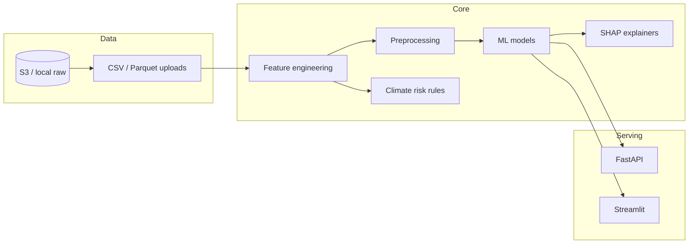

# Agri Yield Pro — Architecture

## Logical view

## Module responsibilities

- **`utils/`** — reusable, testable transforms and analytics (preprocessing, outliers, climate heuristics, metrics, SHAP helpers).
- **`backend/ml_pipeline.py`** — sklearn + XGBoost training and inference contracts.
- **`backend/train.py`** — batch training CLI producing a versioned joblib bundle.
- **`backend/api/main.py`** — stateless inference over HTTP (ECS/Lambda adapter can wrap the same functions).

## AWS reference layout

Typical production deployment keeps training offline (SageMaker, AWS Batch, or Glue) while serving uses:

- **Amazon ECR** for container images built from this repository’s `Dockerfile`.
- **AWS Fargate (ECS)** for long-running `uvicorn` and/or Streamlit tasks behind an **Application Load Balancer**.
- **Amazon S3** for raw datasets, feature stores, and serialized model artifacts; inject paths via `AGRI_MODEL_DIR` / `AGRI_DATA_DIR`.
- **AWS Secrets Manager** for any third-party API keys (not required for the baseline).

For burst scoring at scale, export the trained `Pipeline` to a lightweight container and autoscale on queue depth (SQS + Fargate).
